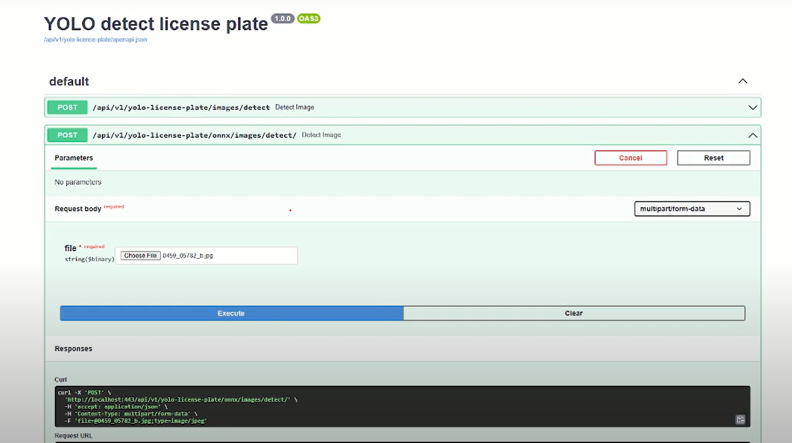
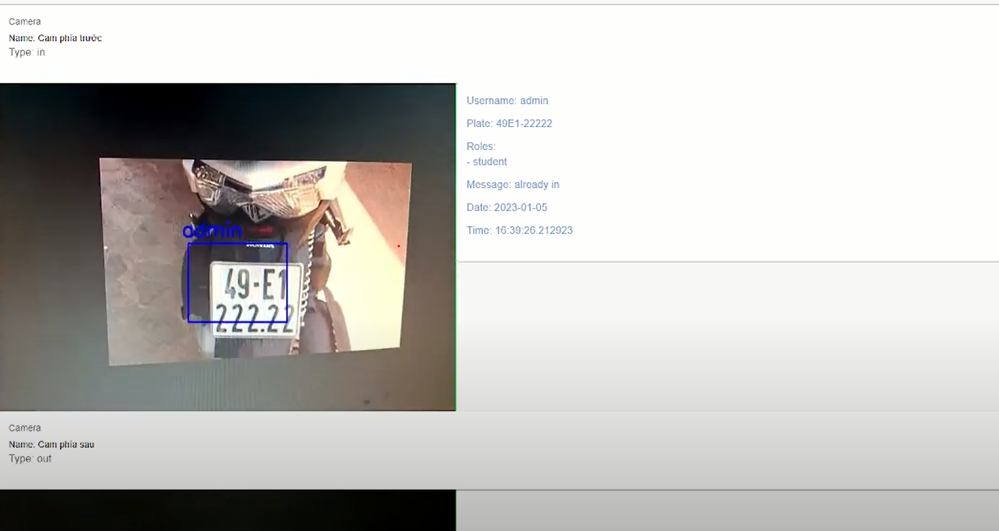

# Vehicle Management
### Description:
A Vehicle Management System that analyze and record the vehicles using ANPR (Automatic number plate recognition)
### Microservice:

In backend folder:
- Auth API: auth folder
- Vehicle Management API: license-plate-app folder
- YOLO detect & recognize Plate API: yolo-license-plate folder
- Realtime License Plate Recognition API: check-vehicle-real-time folder
### Demo:
 1. Swagger:
 [Demo Video Link](https://www.youtube.com/watch?v=Rwx2PFWrNaw)
 - Auth: http://13.112.242.104/api/v1/auth/docs
 - Vehicle Management: http://13.112.242.104/api/v1/license-plate-app/docs
 - YOLO plate recognition: http://13.112.242.104/api/v1/yolo-license-plate/docs  

 2. Realtime License Plate Recognition:
 [Demo Video Link](https://www.youtube.com/watch?v=C4vqtv3u_jI)

### Technology:
 - Microservice:NGINX, FastAPI, Mongodb, YOLO, Docker.
 - Front-end: React.js (Using TypeScript)
 - Realtime Stream: WebSocket, Multi-thread.
### Author:
[Vo Dinh Hoang Long](https://github.com/HoangLongHotarou) 
