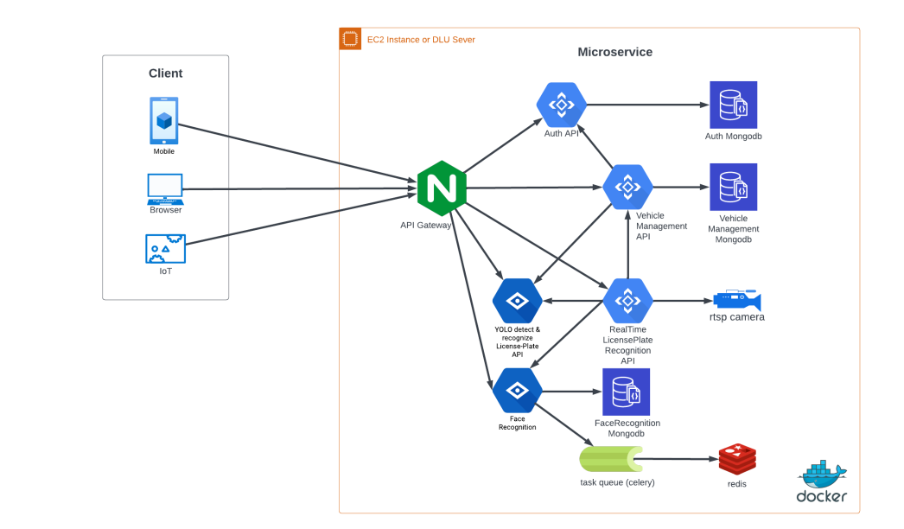

# Smart Vehicle management.
### Description:
A Vehicle Management System that analyze and record the vehicles using ANPR (Automatic number plate recognition) and security using Face-recognition
### Microservice:

Backend folder:
- Managing and authenticating for user
```
├───auth
│   ├───api
│   │   ├───controllers
│   │   ├───models
│   │   ├───routes
│   │   └───services
│   ├───base
│   ├───core
│   ├───db
│   ├───utils
│   └───views
│       └───templates
```

- detecting and recognizing license-place and recognizing face real-time
```
├───check-vehicle-real-time
│   ├───services
│   └───utils
```
- Face recognition use FaceNet, MTCNN and HNSWlib 
```
├───face-recognition
│   ├───api
│   │   ├───ai_model
│   │   ├───controllers
│   │   ├───models
│   │   ├───routes
│   │   ├───services
│   │   └───tasks
│   ├───base
│   ├───core
│   ├───data_file
│   ├───db
│   ├───utils
│   └───views
│       └───templates
```
- Vehicle manager
```
├───license-plate-app
│   ├───api
│   │   ├───controllers
│   │   ├───models
│   │   ├───routes
│   │   ├───schemas
│   │   ├───services
│   │   └───tasks
│   ├───base
│   ├───core
│   ├───db
│   └───utils
```
- License-plate detection and recognition use YOLO
```
└───yolo-license-plate
    ├───base
    ├───ONNXModel
    │   ├───baseONNX
    │   ├───func
    │   └───utils
    ├───onnx_folder
    │   ├───DetectV5
    │   ├───DetectV7
    │   ├───RecognizeV5
    │   └───RecognizeV7
    ├───pt_folder
    │   ├───yolov5s
    │   └───yolov7_tiny
    └───yolo_function
        ├───baseProcessing
        ├───baseYOLO
        ├───yoloV5
        └───yoloV7
```

### Requirement:
Python version >= 3.9
Node module >= v18.16.0

### Technologies:
 - Microservice: NGINX, FastAPI, Mongodb, YOLO, Docker, MTCNN, FaceNet, HNSWlib.
 - Front-end: React.js (Using TypeScript)
 - Realtime Stream: WebSocket, Multi-thread.
