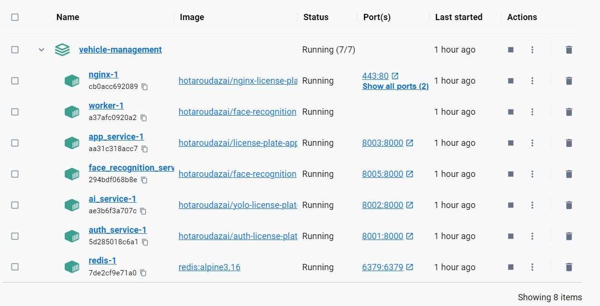
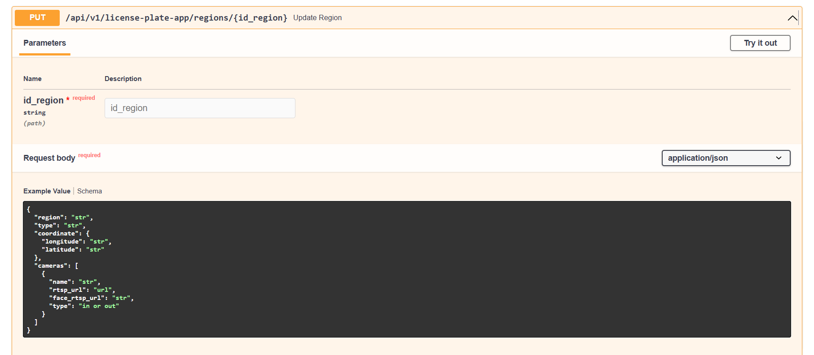

# Hệ thống quản lý bãi đỗ xe thông minh.
### Mô tả:
<!-- A Vehicle Management System that analyze and record the vehicles using ANPR (Automatic number plate recognition) -->
Là một hệ thống nhận diện biển số xe để thống kê và và ghi lại xe ra vào dùng ANPR (Automatic number plate recognition)
### Microservice:

Trong thư mục backend:
- Quản lý và phân quyền người dùng 
```
├───auth
│   ├───api
│   │   ├───controllers
│   │   ├───models
│   │   ├───routes
│   │   └───services
│   ├───base
│   ├───core
│   ├───db
│   ├───utils
│   └───views
│       └───templates
```

- Kiểm tra biển số xe và xác nhận thông qua khuôn mặt Real-time 
```
├───check-vehicle-real-time
│   ├───services
│   └───utils
```
- Nhận diện khuôn mặt
```
├───face-recognition
│   ├───api
│   │   ├───ai_model
│   │   ├───controllers
│   │   ├───models
│   │   ├───routes
│   │   ├───services
│   │   └───tasks
│   ├───base
│   ├───core
│   ├───data_file
│   ├───db
│   ├───utils
│   └───views
│       └───templates
```
- Quản lý phương tiện
```
├───license-plate-app
│   ├───api
│   │   ├───controllers
│   │   ├───models
│   │   ├───routes
│   │   ├───schemas
│   │   ├───services
│   │   └───tasks
│   ├───base
│   ├───core
│   ├───db
│   └───utils
```
- Phát hiện và nhận diện biển số
```
└───yolo-license-plate
    ├───base
    ├───ONNXModel
    │   ├───baseONNX
    │   ├───func
    │   └───utils
    ├───onnx_folder
    │   ├───DetectV5
    │   ├───DetectV7
    │   ├───RecognizeV5
    │   └───RecognizeV7
    ├───pt_folder
    │   ├───yolov5s
    │   └───yolov7_tiny
    └───yolo_function
        ├───baseProcessing
        ├───baseYOLO
        ├───yoloV5
        └───yoloV7
```

### Yêu cầu cấu hình:
Python version >= 3.9
Node module >= v18.16.0
Có thể dùng Yarn để cài đặt phía real-time-web

### Cài đặt
Cài đặt Python:
- [Link tải về]()

Cài đặt Nodejs:
- [Link tải về]()

Cài đặt Docker: 
- Window, Mac: 
    - Link tải docker desktop: [docker desktop](https://www.docker.com/products/docker-desktop/)
    - Hướng dẫn cài đặt Docker trên window:
    [Theo đường dẫn này]()
- Linux: 
    - [Theo như đường dẫn này](https://docs.docker.com/engine/install/ubuntu/)

Đăng kí mongodb cloud: 
- [Link Video](https://www.youtube.com/watch?v=0Pt7Kfh78Jg)

### Bước cài đặt

Khi cài đặt docker thành công

- Thêm dữ liệu vào db:
    ``` bash
    cd db
    mongorestore --uri=<connectionString> dump/
    ```
    muốn tùy chỉnh restore thì có thể đọc [tại đây](https://www.mongodb.com/docs/database-tools/mongorestore/#mongodb-binary-bin.mongorestore)

- Chạy chương trình docker
    ``` bash
    docker-compose up -d
    ```

    

- Chạy realtime-api:

    ``` bash
    cd backend/check-vehicle-real-time
    pip install -r requirements.txt 
    cd backend/check-vehicle-realtime
    python main.py
    ```

- tùy chỉnh giao thức rtsp camera:
    
    nhập id khu vực và tùy chỉnh trong phần camera

- Chạy realtime-web:

    ``` bash
    cd frontend/license-plate-camera
    npm i
    npm start
    ```
  Hoặc dùng yarn (nếu version của bản node của chương trình này đã cũ)
    ``` bash
    cd frontend/license-plate-camera
    yarn
    yarn start
    ```


### Công nghệ sử dụng:
 - Microservice: NGINX, FastAPI, Mongodb, YOLO, Docker, MTCNN, FaceNet, HNSWlib.
 - Front-end: React.js (Using TypeScript)
 - Realtime Stream: WebSocket, Multi-thread.

### Lưu ý khóa sau kế thừa:
Có thể kết thừa các API học máy như face-recognition và yolo-license-plate,

Tối ưu API: có thể thay thế các auth, license-plate-app API trên thành các api ngôn ngữ Go.


### Nhóm:
1911164 - Võ Đình Hoàng Long
1911158 - Nguyễn Hoàng Đăng Khoa
1911166 - Võ Công Lý
